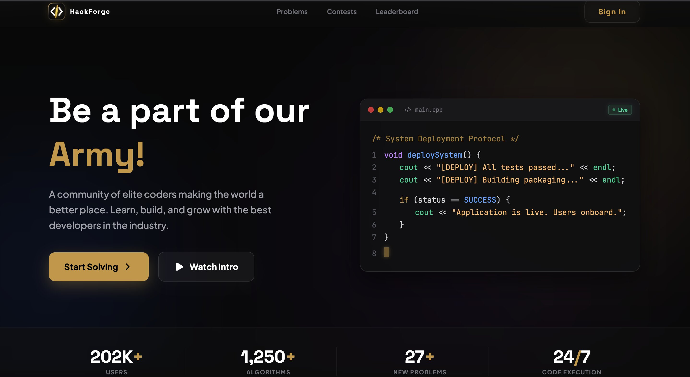
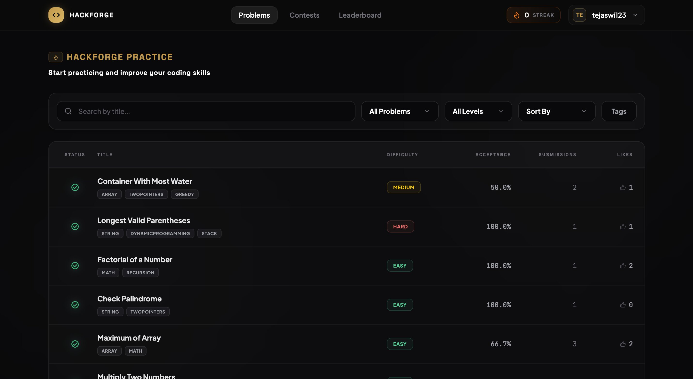
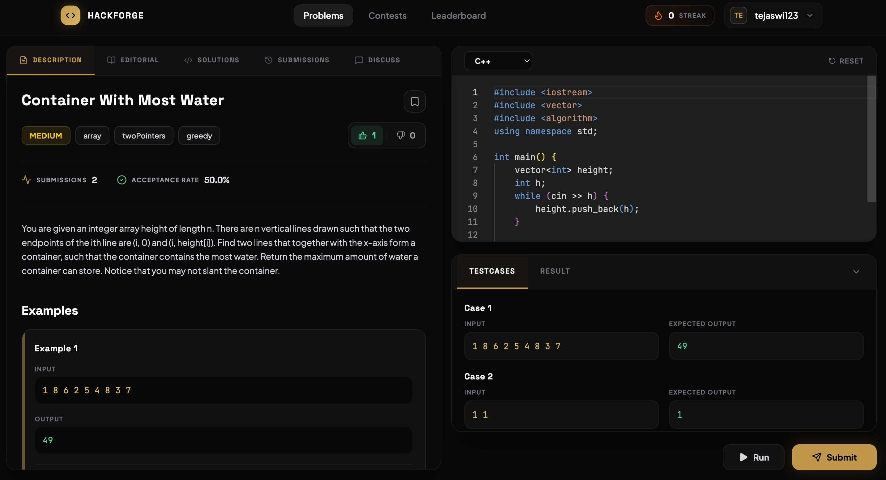
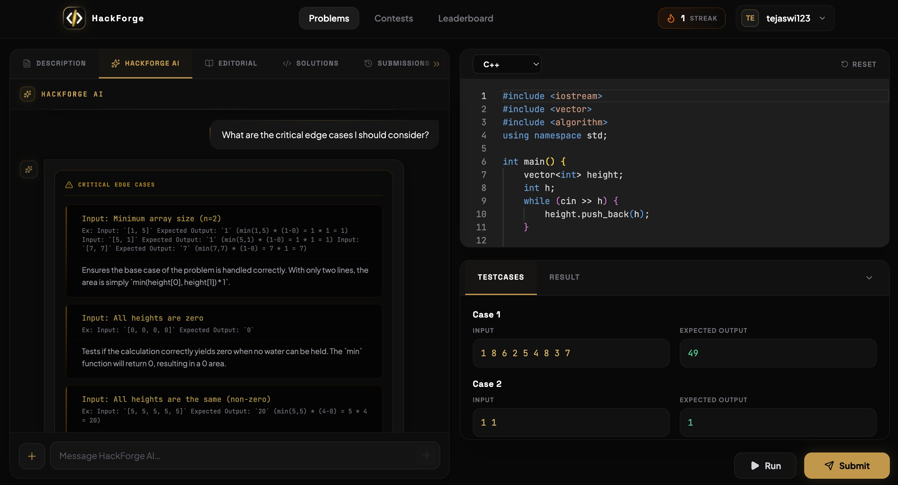
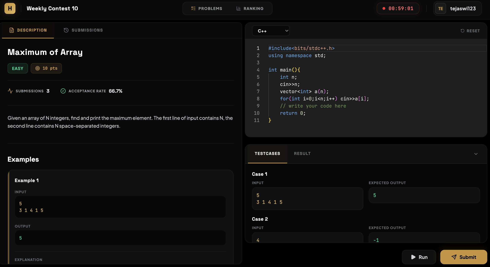
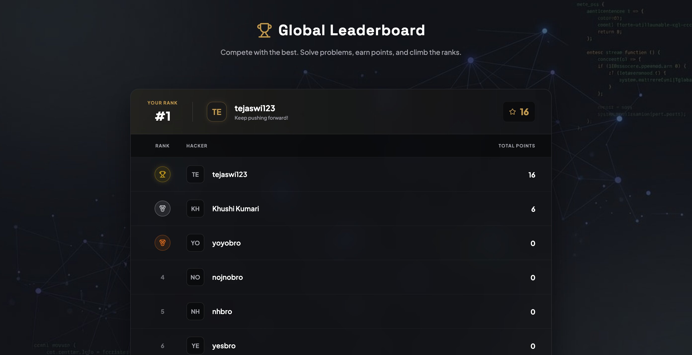
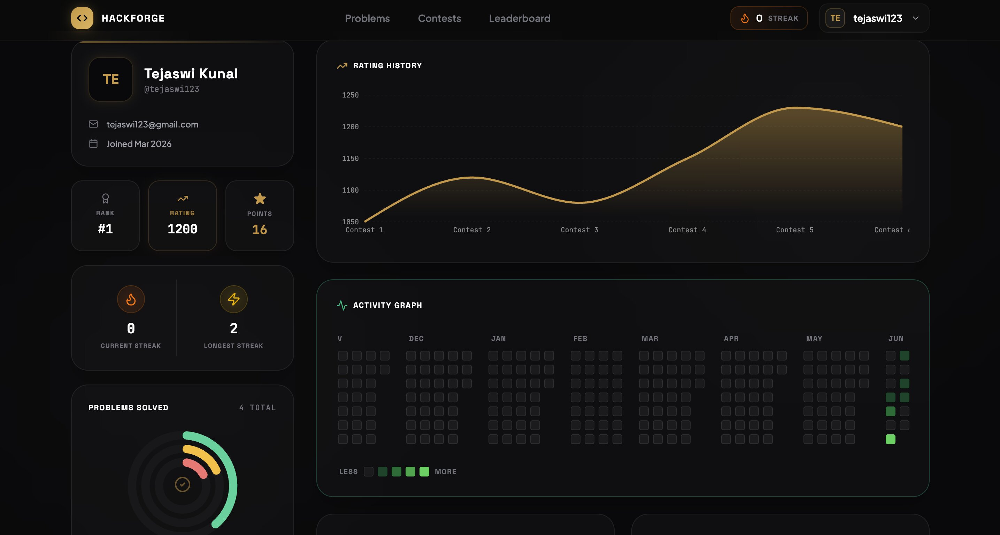
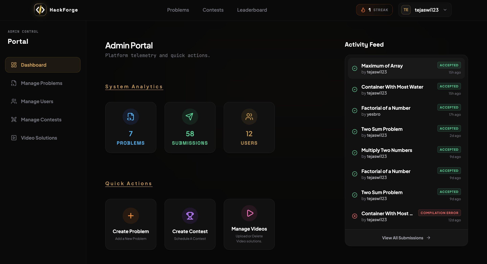
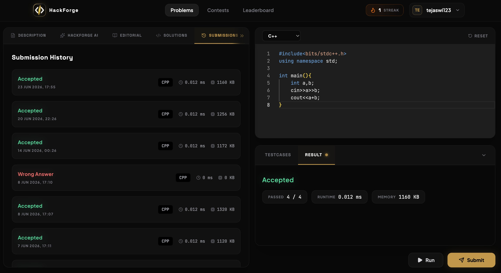

<div align="center">


# ⚡ HackForge

### A full-stack competitive programming platform — built from scratch.
### Practice DSA, compete in live contests, and get AI-powered help.

<br/>

[](https://react.dev/)
[](https://nodejs.org/)
[](https://expressjs.com/)
[](https://www.mongodb.com/)
[](https://redis.io/)
[](https://tailwindcss.com/)
[](https://vitejs.dev/)

<br/>

[](https://hack-forge-psi.vercel.app/)
[](#-api-reference)
[](LICENSE)

</div>

---

## 📖 Table of Contents

- [About the Project](#-about-the-project)
- [Screenshots](#-screenshots)
- [Features](#-features)
- [Tech Stack](#-tech-stack)
- [System Architecture](#-system-architecture)
- [Project Structure](#-project-structure)
- [Getting Started](#-getting-started)
  - [Prerequisites](#prerequisites)
  - [Installation](#installation)
  - [Environment Variables](#environment-variables)
  - [Running Locally](#running-locally)
- [API Reference](#-api-reference)
- [Database Design](#-database-design)
- [Roadmap](#-roadmap)
- [Known Issues](#-known-issues)
- [Contributing](#-contributing)
- [Author](#-author)
- [License](#-license)

---

## 🔥 About the Project

**HackForge** is a production-grade competitive programming platform built as a full-stack project inspired by LeetCode and Codeforces. It supports real-time code execution, timed contests with live leaderboards, an AI assistant tuned for DSA problem-solving, a global ranking system, and a full-featured admin panel — all wrapped in a premium dark UI.

> *"Be a part of our Army — A community of elite coders making the world a better place. Learn, build, and grow with the best developers in the industry."*

### What makes HackForge different?

- **HackForge AI** — A Gemini-powered assistant with 6 specialized modes (hint, debug, complexity, edge cases, explanation, solution) scoped to the exact problem you're solving, with 24-hour chat history stored in Redis.
- **Live Contest Arena** — Timed contests with real-time leaderboards, point-based scoring per difficulty, and per-problem submissions tracked independently.
- **Smart Caching** — Redis caching on the global leaderboard and chat history for fast retrieval at scale.
- **MongoDB Indexing** — Compound and unique indexes on submissions, comments, and reactions to keep high-frequency queries fast.
- **Secure Auth** — JWT stored in httpOnly cookies + Redis-based token blocklist for secure logout.

---

## 📸 Screenshots

### 🏠 Homepage

> Clean hero section with live platform stats — users, algorithms, and 24/7 code execution.

---

### 📋 Problem Listing

> Browse all problems with filters for difficulty, tags, sort order, and search. Solved-state indicators update in real-time.

---

### 💻 Problem Workspace

> Split-pane workspace: problem description, editorial, solutions, submissions, and AI chat on the left — Monaco editor with multi-language support and live testcase runner on the right.

---

### 🤖 HackForge AI

> Problem-scoped AI assistant powered by Gemini Flash 2.5 with 6 specialized modes. Chat history persists for 24 hours via Redis.

---

### 🏆 Contest Arena

> Timed contest workspace with live countdown, per-problem point scoring, submission history, and access to the live leaderboard in a separate tab.

---

### 📊 Global Leaderboard

> Redis-cached global ranking by total points. Your rank card is always pinned at the top.

---

### 👤 User Profile

> Premium profile with rating history graph, GitHub-style activity heatmap, streak tracker, and a donut chart of problems solved by difficulty.

---

### 🛠️ Admin Dashboard

> Full admin portal with system analytics, live activity feed, and quick-action cards for managing problems, contests, and video solutions.

---

### ✅ Submission Results

> Submission history with verdict, runtime, memory, and pass rate — all tracked via compound-indexed MongoDB queries for speed.

---

## ✨ Features

### 👨‍💻 Problem Solving
- Browse problems with search, difficulty filter, tag filter, and sorting
- Split-pane workspace: description left, Monaco editor right
- Multi-language support (C++, Java, Python, JavaScript, and more)
- Run against custom testcases before submitting
- Full submission history with verdict, runtime, and memory usage
- Like / dislike problems with per-user reaction tracking
- Save problems to a personal bookmark list
- Community discussion section with paginated comments (add, edit, delete)
- Editorial tab with video solutions uploaded via Cloudinary

### 🤖 HackForge AI (Gemini Flash 2.5)
- Problem-scoped AI — only answers questions related to the current problem
- **6 Specialized Modes:**
  - `MODE 1` — Complexity Analysis
  - `MODE 2` — Debugging
  - `MODE 3` — Hint System
  - `MODE 4` — Problem Explanation
  - `MODE 5` — Solution Explanation
  - `MODE 6` — Edge Case Analysis
- 24-hour chat history per user per problem, stored in Redis
- Rate-limited to 10 messages per user per 24 hours (fixed window)

### 🏆 Contests
- Browse Running, Upcoming, and Ended contests
- Register for contests before they go live
- Timed contest workspace with live countdown
- Points awarded per problem based on difficulty
- Contest leaderboard showing live rankings by points
- View your personal rank inside any contest

### 📊 Leaderboard & Profile
- **Global Leaderboard** — Redis-cached ranking by total problem points
- **User Profile** — Rating history graph (Recharts), GitHub-style activity heatmap, streak tracking, donut chart of problems solved by difficulty
- **Public Profiles** — View other users' stats and solved problems
- Profile settings: edit display name, avatar, bio, and change password

### 🔐 Authentication & Security
- JWT-based auth stored in httpOnly, secure, sameSite cookies
- Separate middleware for user and admin roles
- Logout invalidates token via Redis blocklist
- Forgot Password flow via Nodemailer with secure token link
- Rate limiting on auth endpoints, submissions, and AI chat to prevent abuse

### 🛠️ Admin Panel
- **Dashboard** — System analytics (total problems, submissions, users), live activity feed
- **Problem Management** — Create, edit, delete problems with full validation
- **Contest Management** — Create, schedule, edit, and delete contests
- **Submission Viewer** — View all platform submissions with verdict and metadata
- **Video Solutions** — Upload, manage, and delete video editorials via Cloudinary (signed upload flow)

---

## 🧰 Tech Stack

| Layer | Technology | Purpose |
|-------|------------|---------|
| **Frontend** | React 19 + Vite 8 | SPA with fast HMR |
| **Styling** | Tailwind CSS v4 + DaisyUI | Utility-first premium UI |
| **Animations** | Framer Motion | Page transitions & micro-animations |
| **State Management** | Redux Toolkit + React Redux | Auth state, chat state |
| **Forms** | React Hook Form + Zod | Input validation with schema |
| **Code Editor** | Monaco Editor (`@monaco-editor/react`) | VS Code-grade editor in browser |
| **Charts** | Recharts | Rating history, activity graph |
| **Icons** | Lucide React | Consistent icon set |
| **HTTP Client** | Axios | API calls with interceptors |
| **Backend** | Node.js + Express 5 | REST API server |
| **Database** | MongoDB + Mongoose | Primary data store |
| **Cache** | Redis (Upstash) | Leaderboard cache, chat history, token blocklist |
| **Code Execution** | Judge0 via RapidAPI | Sandboxed multi-language code runner |
| **AI** | Google Gemini Flash 2.5 (`@google/genai`) | HackForge AI assistant |
| **Media** | Cloudinary | Video solution storage |
| **Email** | Nodemailer | Password reset emails |
| **Auth** | JWT + bcrypt | Token auth + password hashing |
| **Validation** | express-validator | Backend schema validation |
| **Deployment** | Vercel (frontend) + Render (backend) | Free-tier hosting |

---

## 🏗️ System Architecture

```
User Browser
     │
     ▼
┌─────────────────────────────────────────────────────┐
│                    React Frontend                    │
│  Vite · Redux Toolkit · Monaco Editor · Recharts    │
└───────────────────────┬─────────────────────────────┘
                        │ Axios (httpOnly cookies)
                        ▼
┌─────────────────────────────────────────────────────┐
│              Node.js / Express 5 API                 │
│                                                      │
│  ┌─────────────┐  ┌──────────────┐  ┌────────────┐  │
│  │ userMiddlew │  │ adminMiddlew │  │ rateLimiter│  │
│  └─────────────┘  └──────────────┘  └────────────┘  │
│                                                      │
│  Controllers: auth · problem · submission · contest  │
│               leaderboard · ai · comment · video     │
└──────┬───────────────┬──────────────┬───────────────┘
       │               │              │
       ▼               ▼              ▼
┌────────────┐  ┌────────────┐  ┌──────────────────┐
│  MongoDB   │  │   Redis    │  │  External APIs   │
│            │  │            │  │                  │
│ · Problems │  │ · Leaderbd │  │ · Judge0 (exec)  │
│ · Users    │  │ · AI chats │  │ · Gemini AI      │
│ · Submiss  │  │ · Token    │  │ · Cloudinary     │
│ · Contests │  │   blocklist│  │ · Nodemailer     │
│ · Comments │  └────────────┘  └──────────────────┘
│ · Reactions│
└────────────┘
```

### Code Submission Flow

```
User clicks Submit
      │
      ▼
Express → contestSubmitMiddleware (checks if contest is active)
      │
      ▼
Base64 encode source code
      │
      ▼
POST to Judge0 (RapidAPI) → returns token
      │
      ▼
Poll Judge0 for result
      │
      ▼
Parse verdict (Accepted / WA / TLE / CE / RE)
      │
      ▼
Save Submission to MongoDB (compound index: user + problem)
      │
      ▼
Update user points if Accepted (first solve)
      │
      ▼
Return result to frontend
```

### Video Upload Flow (Cloudinary Signed Upload)

```
Admin requests upload
      │
      ▼
Backend generates: api_key + signature + timestamp + cloud_name
      │
      ▼
Frontend uploads directly to Cloudinary (authenticated)
      │
      ▼
Cloudinary returns metadata (public_id, url, duration)
      │
      ▼
Frontend POSTs metadata to backend → saved in solutionVideo collection
```

---

## 📁 Project Structure

```
hackforge/
├── backend/
│   └── src/
│       ├── config/
│       │   ├── db.js               # MongoDB connection
│       │   └── redis.js            # Redis client (Upstash)
│       ├── controller/
│       │   ├── userAPI.js          # Auth, profile, account
│       │   ├── problemAPI.js       # CRUD, filters, reactions, saves
│       │   ├── submissionAPI.js    # submitCode, runCode via Judge0
│       │   ├── contestAPI.js       # Contest lifecycle, registration, leaderboard
│       │   ├── leaderboardAPI.js   # Global leaderboard (Redis cached)
│       │   ├── aiController.js     # Gemini AI chat, history, rate limit
│       │   ├── commentAPI.js       # Problem discussion comments
│       │   ├── adminController.js  # Dashboard stats, admin-specific views
│       │   └── videoSolutionAPI.js # Cloudinary signed upload, save, delete
│       ├── middleware/
│       │   ├── userMiddleware.js        # JWT verification + Redis blocklist check
│       │   ├── adminMiddleware.js       # Admin role verification
│       │   └── contestSubmitMiddleware.js # Validates contest state on submit
│       ├── model/
│       │   ├── User.js             # User schema (points, streak, solved problems)
│       │   ├── Problems.js         # Problem schema with test cases & solutions
│       │   ├── Submission.js       # Submission with compound index (user, problem)
│       │   ├── Contest.js          # Contest schema (start/end time, problems, points)
│       │   ├── ContestParticipant.js # Per-participant submissions & score
│       │   ├── Comment.js          # Comments with problem ref + pagination index
│       │   ├── Reaction.js         # Unique compound index (user, problem)
│       │   └── solutionVideo.js    # Cloudinary metadata per problem
│       ├── router/                 # Express routers (auth, problem, submission, etc.)
│       └── utils/
│           ├── rateLimiter.js      # Fixed-window rate limiters (auth, submit, AI)
│           ├── validateProblem.js  # express-validator problem schema
│           ├── validateContest.js  # express-validator contest schema
│           ├── validateUser.js     # express-validator user schema
│           ├── ProblemUtility.js   # Judge0 helpers, base64 encode/decode
│           └── sendEmail.js        # Nodemailer email sender
│
└── frontend/
    └── src/
        ├── components/
        │   ├── LeftWorkspace.jsx        # Tab router: description/AI/editorial/etc.
        │   ├── RightWorkspace.jsx       # Monaco editor + testcase runner
        │   ├── ChatAITab.jsx            # HackForge AI chat panel
        │   ├── DescriptionTab.jsx       # Problem statement, examples, constraints
        │   ├── EditorialTab.jsx         # Video solution player
        │   ├── SubmissionsTab.jsx       # Per-problem submission history
        │   ├── CommentsTab.jsx          # Community discussion
        │   ├── ContestDescriptionTab.jsx # Contest problem view
        │   ├── ContestHeader.jsx        # Countdown timer + contest nav
        │   ├── Header.jsx               # Global nav with streak counter
        │   └── ProfileSidebar.jsx       # Profile stats sidebar
        ├── pages/
        │   ├── Homepage.jsx             # Landing page
        │   ├── Problem.jsx              # Problems list with filters
        │   ├── ProblemSubmit.jsx        # Full problem workspace
        │   ├── Profile.jsx              # User profile with graphs & heatmap
        │   ├── PublicProfile.jsx        # View another user's profile
        │   ├── Leaderboard.jsx          # Global leaderboard
        │   ├── ContestHub.jsx           # Running / Upcoming / Ended contests
        │   ├── ContestWorkspace.jsx     # Timed contest arena
        │   ├── ContestLeaderboard.jsx   # Live contest rankings
        │   ├── AdminDashboardOverview.jsx # System stats + activity feed
        │   ├── AdminSubmissions.jsx     # All platform submissions view
        │   ├── CreateProblem.jsx        # Problem creation form
        │   ├── EditProblem.jsx          # Problem edit form
        │   ├── CreateContest.jsx        # Contest scheduler
        │   ├── AdminVideo.jsx           # Video solution management
        │   └── ...                      # Other settings & admin pages
        ├── redux/
        │   ├── store.js                 # Redux store
        │   ├── authSlice.js             # User auth state
        │   └── chatSlice.js             # AI chat state
        └── utils/
            └── axiosClient.js           # Axios instance with baseURL + credentials
```

---

## 🚀 Getting Started

### Prerequisites

Make sure you have the following installed and set up:

| Requirement | Version | Notes |
|-------------|---------|-------|
| Node.js | `>= 18.x` | Check with `node -v` |
| npm | `>= 9.x` | Comes with Node |
| MongoDB | Atlas (cloud) or local | Connection string required |
| Redis | Upstash (recommended) or local | For leaderboard cache + AI history |
| Judge0 API Key | RapidAPI free tier | For code execution |
| Gemini API Key | Google AI Studio (free) | For HackForge AI |
| Cloudinary Account | Free tier | For video solutions |
| Gmail App Password | Google Account settings | For password reset emails |

---

### Installation

**1. Clone the repository**

```bash
git clone https://github.com/tejaswi-kunal/HackForge.git
cd HackForge
```

**2. Install Backend dependencies**

```bash
cd backend
npm install
```

**3. Install Frontend dependencies**

```bash
cd ../frontend
npm install
```

---

### Environment Variables

Create a `.env` file inside the `backend/` directory:

```bash
cd backend
cp .env.example .env   # or create it manually
```

Then fill in all values:

```env
# ── Server ──────────────────────────────────────────
PORT=8000
FRONTEND_URL=http://localhost:5173

# ── MongoDB ─────────────────────────────────────────
DB_CONNECTION_STRING=mongodb+srv://<username>:<password>@cluster0.mongodb.net/hackforge

# ── JWT ─────────────────────────────────────────────
SECRET_KEY=your_super_secret_jwt_key_here

# ── Redis (Upstash recommended) ──────────────────────
REDIS_USERNAME=default
REDIS_PASSWORD=your_redis_password
REDIS_SOCKET_HOST=your-upstash-endpoint.upstash.io
REDIS_SOCKET_PORT=19330

# ── Judge0 via RapidAPI ──────────────────────────────
RAPID_API_KEY=your_rapidapi_key
RAPID_URL=https://judge0-ce.p.rapidapi.com
RAPID_API_HOST=judge0-ce.p.rapidapi.com

# ── Cloudinary (Video Solutions) ─────────────────────
CLOUDINARY_CLOUD_NAME=your_cloud_name
CLOUDINARY_API_KEY=your_cloudinary_api_key
CLOUDINARY_API_SECRET=your_cloudinary_api_secret

# ── Gemini AI ────────────────────────────────────────
GEMINI_API_KEY=your_gemini_api_key

# ── Email (Nodemailer / Gmail) ───────────────────────
EMAIL_USER=youremail@gmail.com
EMAIL_PASS=your_gmail_app_password   # Use App Password, not your real password
```

> **Getting a Gmail App Password:**
> Google Account → Security → 2-Step Verification → App passwords → Generate

> **Getting Judge0 on RapidAPI:**
> Go to [RapidAPI Judge0 CE](https://rapidapi.com/judge0-official/api/judge0-ce) → Subscribe to free tier → Copy API key

---

### Running Locally

**Start the Backend** (from `backend/` directory):

```bash
npm run dev
# Server starts on http://localhost:8000
```

**Start the Frontend** (from `frontend/` directory, in a separate terminal):

```bash
npm run dev
# App opens on http://localhost:5173
```

**Build Frontend for Production:**

```bash
cd frontend
npm run build
```

---

## 📡 API Reference

All API endpoints are prefixed relative to your backend base URL. Authentication uses JWT stored in httpOnly cookies. Protected routes require the `userMiddleware` or `adminMiddleware` to pass.

### 🔐 Auth Routes — `/api/auth`

| Method | Endpoint | Auth | Description |
|--------|----------|------|-------------|
| `POST` | `/register` | ❌ | Register new user (rate limited) |
| `POST` | `/login` | ❌ | Login user (rate limited) |
| `POST` | `/logout` | ✅ User | Logout + add token to Redis blocklist |
| `GET` | `/getAccount` | ✅ User | Get logged-in user's full profile |
| `GET` | `/checkAuth` | ✅ User | Verify auth status |
| `PUT` | `/updateProfile` | ✅ User | Update display name, bio, avatar |
| `PUT` | `/changePassword` | ✅ User | Change password (requires old password) |
| `DELETE` | `/deleteAccount` | ✅ User | Permanently delete account |
| `GET` | `/getPublicProfile/:id` | ✅ User | View another user's public profile |
| `GET` | `/getUserSubmissions` | ✅ User | All submissions made by logged-in user |
| `POST` | `/forgot-password` | ❌ | Send password reset email (rate limited) |
| `GET` | `/reset-password/:token` | ❌ | Validate reset token |
| `POST` | `/reset-password/:token` | ❌ | Set new password using token |
| `POST` | `/admin/register` | ✅ Admin | Register a new admin account |

---

### 📝 Problem Routes — `/api/problem`

| Method | Endpoint | Auth | Description |
|--------|----------|------|-------------|
| `GET` | `/getAllProblem` | ✅ User | Paginated list of all problems |
| `GET` | `/getProblem/:id` | ✅ User | Get single problem with full details |
| `GET` | `/filter` | ✅ User | Filter problems by difficulty, tags, search |
| `GET` | `/getProblemStats` | ✅ User | Platform-wide problem count by difficulty |
| `GET` | `/getAllProblemSolvedByUser` | ✅ User | List of problems solved by current user |
| `GET` | `/getSubmissions/:id` | ✅ User | All submissions for a problem by current user |
| `POST` | `/create` | ✅ Admin | Create a new problem |
| `PUT` | `/update/:id` | ✅ Admin | Edit an existing problem |
| `DELETE` | `/delete/:id` | ✅ Admin | Delete a problem |
| `POST` | `/saveProblem/:id` | ✅ User | Bookmark a problem |
| `POST` | `/unsaveProblem/:id` | ✅ User | Remove bookmark |
| `GET` | `/getSavedProblems` | ✅ User | List all bookmarked problems |
| `GET` | `/checkSaved/:id` | ✅ User | Check if a problem is bookmarked |
| `POST` | `/like/:id` | ✅ User | Like a problem |
| `POST` | `/dislike/:id` | ✅ User | Dislike a problem |
| `GET` | `/reaction/:id` | ✅ User | Get current user's reaction to a problem |

---

### ▶️ Submission Routes — `/api/submission`

| Method | Endpoint | Auth | Description |
|--------|----------|------|-------------|
| `POST` | `/submitCode/:id` | ✅ User | Submit solution — runs via Judge0, saves result (rate limited) |
| `POST` | `/runCode/:problemID` | ✅ User | Run code against custom input — no submission saved |

---

### 🏆 Contest Routes — `/api/contest`

| Method | Endpoint | Auth | Description |
|--------|----------|------|-------------|
| `GET` | `/getRunningContest` | ✅ User | Fetch all currently live contests |
| `GET` | `/getUpcomingContest` | ✅ User | Fetch all scheduled upcoming contests |
| `GET` | `/getEndedContest` | ✅ User | Fetch all past contests |
| `GET` | `/getContest/:id` | ✅ User | Get contest details by ID |
| `POST` | `/contestRegistration/:id` | ✅ User | Register for a contest |
| `GET` | `/enterContest/:id` | ✅ User | Validate access + enter contest arena |
| `GET` | `/getLeaderBoard/:id` | ✅ User | Contest leaderboard by score |
| `GET` | `/myRank/:id` | ✅ User | Get current user's rank in a contest |
| `POST` | `/createContest` | ✅ Admin | Create and schedule a new contest |
| `PUT` | `/updateContest/:id` | ✅ Admin | Edit contest details |
| `DELETE` | `/deleteContest/:id` | ✅ Admin | Delete a contest |

---

### 🤖 AI Routes — `/api/ai`

| Method | Endpoint | Auth | Description |
|--------|----------|------|-------------|
| `POST` | `/chat` | ✅ User | Send message to HackForge AI (rate limited: 10/24hr) |
| `GET` | `/history/:problemId` | ✅ User | Fetch 24-hour chat history for a problem |

---

### 💬 Comment Routes — `/api/comment`

| Method | Endpoint | Auth | Description |
|--------|----------|------|-------------|
| `POST` | `/addComment/:id` | ✅ User | Add a comment to a problem |
| `GET` | `/getComments/:id` | ✅ User | Paginated comments for a problem |
| `PUT` | `/editComment/:id` | ✅ User | Edit your own comment |
| `DELETE` | `/deleteComment/:id` | ✅ User | Delete your own comment |

---

### 📊 Leaderboard Routes — `/api/leaderboard`

| Method | Endpoint | Auth | Description |
|--------|----------|------|-------------|
| `GET` | `/getLeaderboard` | ✅ User | Global leaderboard (Redis cached) — sorted by total points |

---

### 🎬 Video Routes — `/api/video`

| Method | Endpoint | Auth | Description |
|--------|----------|------|-------------|
| `GET` | `/create/:problemId` | ✅ Admin | Generate Cloudinary signed upload params |
| `POST` | `/save` | ✅ Admin | Save video metadata after Cloudinary upload |
| `DELETE` | `/delete/:problemId` | ✅ Admin | Delete video from Cloudinary + DB |

---

### 🛡️ Admin Routes — `/api/admin`

| Method | Endpoint | Auth | Description |
|--------|----------|------|-------------|
| `GET` | `/dashboard-stats` | ✅ Admin | System analytics: problem/submission/user counts + recent activity |
| `GET` | `/submissions` | ✅ Admin | All platform submissions with details |
| `GET` | `/getProblem/:id` | ✅ Admin | Admin view of a problem |
| `GET` | `/getUpcomingContestDetails/:id` | ✅ Admin | Admin view of an upcoming contest |

---

## 🗄️ Database Design

### Key MongoDB Indexes

Performance-critical indexes applied to support high-frequency queries:

```
Submission Collection:
  { userId: 1, problemId: 1 }    → Compound index (profile page + problem submission history)
  { userId: 1 }                  → Single index (fetch all user submissions)

Comment Collection:
  { problemId: 1, createdAt: -1 } → Compound index (paginated comments per problem)

Reaction Collection:
  { userId: 1, problemId: 1 }    → Unique compound index (one reaction per user per problem)
```

### Why separate `Comment` and `ContestParticipant` collections?

MongoDB enforces a **16MB limit per document**. Embedding comments inside the `Problem` document would quickly exceed this limit and make pagination impossible. Similarly, `ContestParticipant` is separated from `Contest` to allow the contest system to scale independently of participant count.

---

## 🗺️ Roadmap

| Feature | Status |
|---------|--------|
| Core problem solving + Judge0 | ✅ Done |
| Authentication + JWT + Redis token blocklist | ✅ Done |
| Contest system (running / upcoming / ended) | ✅ Done |
| Live contest leaderboard | ✅ Done |
| HackForge AI (Gemini + 6 modes) | ✅ Done |
| Global leaderboard with Redis cache | ✅ Done |
| User profile with heatmap + rating graph | ✅ Done |
| Admin dashboard + full CRUD | ✅ Done |
| Cloudinary video editorials | ✅ Done |
| Community comments + reactions | ✅ Done |
| MongoDB indexing | ✅ Done |
| Email (Nodemailer) — works locally | ✅ Done |
| Email via Resend (deployed fix) | 🚧 In Progress |
| WebSockets for live contest leaderboard | 🚧 In Progress |
| Contest penalty system | 🚧 In Progress |
| Contest rating system (Elo/similar) | 🚧 In Progress |
| Message queue for submission scaling | 🔜 Planned |
| AI Tutor (topic-based learning paths) | 🔜 Planned |
| User management in Admin panel | 🔜 Planned |
| Discussion forums | 🔜 Planned |

---

## ⚠️ Known Issues

> These issues exist in the **deployed version** only. Everything works correctly in local development.

1. **Password Reset Email** — Nodemailer doesn't work reliably on Render's free tier due to port restrictions. Working fix: migrate to [Resend](https://resend.com/).

2. **Contest Leaderboard Auto-refresh** — Currently opens in a new tab and requires a manual refresh to update. Will be fixed with WebSocket integration.

3. **API Rate Limits (Free Tier)** — The Judge0 RapidAPI free plan has a daily request limit. Heavy simultaneous use may temporarily return errors. Same applies to Gemini Flash 2.5 free tier under high traffic.

4. **Cold Start Delay** — Both backend (Render) and frontend (Vercel) may take 30–60 seconds to respond on first load due to free-tier spin-down. This is a hosting limitation, not a code issue.

---

## 🤝 Contributing

Contributions are welcome! Here's how to get started:

```bash
# 1. Fork the repo on GitHub

# 2. Clone your fork
git clone https://github.com/tejaswi-kunal/HackForge.git

# 3. Create a feature branch
git checkout -b feature/your-feature-name

# 4. Make your changes and commit
git commit -m "feat: add your feature description"

# 5. Push to your fork
git push origin feature/your-feature-name

# 6. Open a Pull Request on the main repo
```

**Please ensure:**
- Your code follows the existing style (ESLint is configured)
- All existing features still work after your change
- New features are briefly described in your PR description

---

## 👨‍💻 Author

**Tejaswi Kunal**

[](https://github.com/tejaswi-kunal)
[](https://www.linkedin.com/in/tejaswi-kunal/)

---

## 📄 License

This project is licensed under the **MIT License** — you are free to use, modify, and distribute this code with attribution.

```
MIT License

Copyright (c) 2026 Tejaswi Kunal

Permission is hereby granted, free of charge, to any person obtaining a copy
of this software and associated documentation files (the "Software"), to deal
in the Software without restriction, including without limitation the rights
to use, copy, modify, merge, publish, distribute, sublicense, and/or sell
copies of the Software, and to permit persons to whom the Software is
furnished to do so, subject to the following conditions:

The above copyright notice and this permission notice shall be included in all
copies or substantial portions of the Software.
```

---

<div align="center">

**⭐ If you found this project useful, please give it a star — it really helps!**

Made with ❤️ by Tejaswi Kunal

🌐 **Frontend (Live Demo):** https://hack-forge-psi.vercel.app/

⚙️ **Backend API:** https://hackforge-62y1.onrender.com

[](https://hack-forge-psi.vercel.app/)

</div>